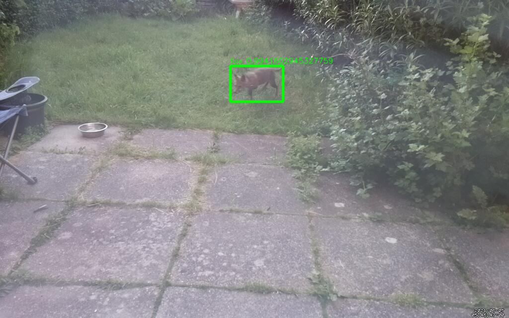

# Squirrel detector


During lock down we were adopted by the squirrel who frequents our garden.

Now I'd like to be notified when a squirrel is outside the window,
so I built a Raspberry Pi webcam and trained a TensorFlow model to recognise squirrels.

I learnt how to retrain an existing TensorFlow object detection model to recognise
new objects and how to use that model from my own code.

- [Hardware](#hardware)
- [Detecting motion and capturing images](#detecting-motion-and-capturing-images)
- [Not squirrel](https://github.com/tonytw1/squirrel-detector#not-squirrel)
- [Object detection APIs](#object-detection-apis)
- [TensorFlow object detection models](#tensorflow-object-detection-models)
- [Testing in Google Colab](#testing-in-google-colab)
- [Running a model with TensorFlow Serving](#running-a-model-with-tensorflow-serving)

- [Retraining](#retraining)
- [Annotating images](#annotating-images)
- [Training](#training)
- [Exporting the model](#exporting-the-model)

- [Inference speed](#inference-speed)
- [Tweaking the model](#tweaking-the-model)

- [Putting it all together](#putting-it-all-together)

- [Results](#results)


## Hardware

We're using a [Raspberry Pi Zero W](https://www.raspberrypi.org/products/raspberry-pi-zero-w/) with the
[Camera Module V2](https://www.raspberrypi.org/products/camera-module-v2/).

This gives us Wifi, 1 CPU core and 512Mb of memory.

The camera module appears as a Video4Linux device.
You can see device details with this command:
```
v4l2-ctl --all
```

## Detecting motion and capturing images

The camera needs to be motion sensitive.

[Motion](https://motion-project.github.io) handles motion detection and is available as a Raspberry Pi package.
It does a good job of detecting movement and can output image files and bounding boxes.

Here's an example of Motion detecting movement and generating a bounding box:


We'd like Motion to detect bounding boxes but not draw them onto the saved image files.
This line in the Motion configuration file controls this:
```
locate_motion_mode preview
```

Motion seems to have an issue with the Pi camera's auto exposure mode; the exposure will swing back and forth between
too light and too dark.

This can be worked around by setting the capture resolution to 1024 x 640. I do not know why this works.

The Pi Zero which the camera is connected to is a small device with limited processing capability.
We'll want to send the captured images somewhere where a more capable machine can look at them.

Let's use a python script to catch the Motion events and publish them.

This script needs to capture the image file path and bounding box from Motion and encode them into a message.

Motion has a callback named `on_picture_save` is able to call one of our scripts with the image file path and bounding box
everytime a image is captured.

We can hook these together with this configuration line:

`on_picture_save python3 /home/pi/on_motion_detected.py %f %w %h %K %L %i %J`

We'll need to encode the image file for inclusion in a message. Base64 encoding should be enough.

We'll use [MQTT](https://mqtt.org) to transport the messages.
MQTT is simple and really practical about message sizes limits.

We can publish the motion messages to a MQTT topic which other machines can subscribe to.

This all happens in the script `on_motion_detected.py`.

[on_motion_detected.py](on_motion_detected.py)


## Not squirrel

It quickly became apparent that there were more than squirrels in the garden.


This is not a squirrel.

Just alerting everytime motion was deteched was not going to be enough.
We'll need to categorise the objects in the captured image files so that we can filter for squirrels.


## Object detection APIs

We have a message containing a still image with a bounding box enclosing an area of motion.
We want to know what the object which triggered the camera is.

We can send the image to an object detection API todo this.

Object detection APIs take an image and attempt to identify the visible objects.

If we can find an Object detecton API which can identify squirrels, we'll be done.


### Google Vision

Google Vision seems to be the gold standard for object detection and has a nice python API.

It also seems to know about squirrels.

Here's a script to detect objects an image file and it's sample output:

[google-vision.py](google-vision.py)


Google Vision clearly knows about squirrels.


### Local alternatives?

The free tier for Google Vision is less suited for continuous use.

Is there anything we can run locally?

Pretrained TensorFlow object detection models are available and running one locally might be an interesting side quest.

There are 2 interesting problems here. Can we find a model which can detect the objects we're interested in (squirrels) 
and can we easily run it and call it locally?

The model will need to be wrapped in some sort of API so we can call it from our own code.


## TensorFlow object detection models

The [TensorFlow Detection Model Zoo](https://github.com/tensorflow/models/blob/master/research/object_detection/g3doc/tf2_detection_zoo.md)
contains saved models have been pretrained and can be downloaded.

They can be used to run detections against our images.

Let's pick a pretrained model and try to run it against one of our test images.

Working on a local machine I was blocked almost immediately with an error while trying to load the saved model.

This could be a mismatch between TensorFlow 2.5 and the available examples.

Rather than get stuck trying to resolve dependencies we can retreat to a [Google Colab](https://colab.research.google.com) notebook.
Colab gives us a known good development environment to get started in.


### Testing in Google Colab

Alot of data development work happens in notebook environments like Jupyter and Colab.

The data community have discovered a really interesting way of working here.
I'd encourage any software developer who haven't seen this before to have a look.

With an existing object detection model imported into our Colab notebook we can load one of our test images and ask the model to detect (or predict) the visible objects.


Requesting a prediction:


The prediction returns a large map of results.


`detection_classes` and `detection_scores` are interesting.

This turns out to mean a 73% confidence of a class 17 object.

What does this mean? What are classes and why are the values all below 100?

The saved model was trained on the [COCO image set](https://cocodataset.org).
This is a well known set of training data containing 91 unique objects (or classes).

The class ids refer to one of these COCO object types.

The COCO labels are available in the file [mscoco_label_map.pbtxt](https://github.com/tensorflow/models/blob/master/research/object_detection/data/mscoco_label_map.pbtxt):

```
item {
  name: "/m/015qbp"
  id: 14
  display_name: "parking meter"
}
item {
  name: "/m/01yrx"
  id: 17
  display_name: "cat"
}
item {
  name: "/m/04dr76w"
  id: 44
  display_name: "bottle"
}
```

### Not cat

Plotting the most confident prediction over the image:


Looking up class 17 in the label file we find `cat`.

Close but not quite right. It looks like the model doesn't know about squirrels!

Looking in the COCO labels file confirms that squirrels are not one of the classes this model was trained to detect.
The model can't identify squirrels because it has not been trained with examples of what squirrels look like.


### Local detection script

Back porting what we learnt in the Colab worksheet we can create a local script which can make the same prediction
as the Colab worksheet.

There is plenty in here which I don't yet understand yet:

[detect.py](detect.py)


### Resolving labels

TensorFlow gives the impression that resolving class ids into labels (ie. `17` -> `cat`) is not it's concern.

We'll need to spike out a way to use the labels file to resolve readable names for classes in the predictions returned from TensorFlow.

[labels/labels.py](labels/labels.py)


### Premature oroductionisation

We've now verified that we can use TensorFlow to run a pretrained model locally.

That pretrained model doesn't know about the specific animals we're interested in but it can probably be retrained.

Let's move onto productionising what we have on the assumption we'll be able to improve the model later.


## Running a model with TensorFlow Serving

[TensorFlow Serving](https://www.tensorflow.org/tfx/serving/docker) claims to "make it easy to deploy new algorithms and experiments,
while keeping the same server architecture and APIs".

This looks like exactly what we want; a way to deploy a saved model behind a REST API.

A Docker container is provided. 
We can use this as a base image to produce an image with our model baked into it:

[serving/Dockerfile](serving/Dockerfile)

Testing locally:

`
docker run -p 8501:8501 -e MODEL_NAME=ssd_mobilenet_v2_320x320_coco17_tpu-8 eelpie/tensorflowserving
`

Check the models is available at `http://localhost:8501/v1/models/ssd_mobilenet_v2_320x320_coco17_tpu-8`

```
{
    "model_version_status": [
        {
            "version": "1",
            "state": "AVAILABLE",
            "status": {
                "error_code": "OK",
                "error_message": ""
            }
        }
    ]
}
```

Now we can ask for a prediction with an HTTP call rather than importing the TensorFlow model into our script:

[detect_rest.py](detect_rest.py)


## Retraining

Our existing model doesn't know about squirrels. We need to retrain it.


### Collecting training data

We can teach our object detection model about the objects we are interested in (squirrels) by
showing it lots of example images containing those objects.

Unlike humans, animals won't generally give out personally identifying informational for free.

They will trade for food though.
Leaving some nuts outside the window and saving the image files captured by Motion provided some initial training images.

Collecting several days worth gave a collection of several hundred images with examples of most of the garden animals.


### Annotating images

TensorFlow wants a set of custom classes representing the objects we are interested in (ie. squirrel, fox etc).

It also needs a set of example images with instances of these classes highlighted.

If the question is 'where is the squirrel in this picture?' then we need to provide many examples of the correct answer.

An image annotation tool like [VoTT (Visual Object Tagging Tool)](https://github.com/microsoft/VoTT) will help here.


Tagging with VoTT:


These tools are optimised for smooth workflow.
I managed to tag 230 images in 30 minutes on my first attempt.
This was much quicker than expected and somewhat cathartic.

VoTT can export TensorFlow Records for direct import into TensorFlow.


### Split the data

We need to reserve some of our test data for testing (or evaluating) our retrained model.

Just like a real exam it needs to be tested on questions it's not seen before.
We split the examples approximately 80% / 20% between training and evaluating.

```
cd Squirrels-TFRecords-export
mkdir training
mkdir eval
mv *.tfrecord training
mv training/*0-00.tfrecord eval
mv training/*1-00.tfrecord eval
```

A better splitting would probably try to get a representative spread of classes into the evaluation folder
(so that we don't produce a model which is excellent at detecting foxes but poor at squirrels).


### Object Detection API

The TensorFlow Object Detection API seems to be TensorFlow's high level wrapper around this type of problem.

The [installation instructions](https://github.com/tensorflow/models/blob/master/research/object_detection/g3doc/tf2.md)
seem to have suffered from python and CUDA dependency rot.

Getting a working GPU enabled install of TensorFlow and the Object Detection API was difficult.

My attempts at working around this are documented in this Dockerfile: [retraining/Dockerfile](retraining/Dockerfile).


### Training

With our training data prepared we need to add an existing pretrained base model,
a training pipeline to describe the training task and a checkpoint to describe the training state the existing model has already reached.

The intuition here is that our existing model has been extensively trained (at great expense) on a general set of data 
(like COCO) and therefore has some general ability at detecting objects.

By preserving this existing training and introducing a new set of objects we should be able to generate a model
which works for our objects far quicker than if we tried to train from scratch.

The TensorFlow checkpoint which came with the existing model encapsulates it's existing training.

When we start the retraining process, over the course of several hours TensorFlow will attempt to readjust the model
parameters to minimise prediction error (or loss) against our new training images.

[retraining/train.bash](retraining/train.bash)

The loss value would be expected to tread downwards during training; probably towards a value between 0.0 and 1.0.


While training TensorFlow will periodically log out a progress report.

```
I0524 17:03:34.777422 139797117065024 model_lib_v2.py:680] Step 400 per-step time 1.050s loss=1.978
```

For a constant batch size the per-step-time should give is a rough way to compare different hardware options.

Comparing some of our locally available hardware:

```
4 core 3.4 GHz CPU ~ 5.0s
2 x 10 core 2.8 GHz CPU ~ 2.7s
GTX 1050 Ti 4Gb ~ 1.0s
```

Training appears to benefit from higher CPU frequency but less so from more CPU cores.
GPUs are very beneficial but smaller desktop GPUs lack the RAM to load a large object detection model.


### Checkpoints

As it trains, TensorFlow periodically drops check points.
These represent the current parameter settings for the model.
Training is about finding the model parameters which best fit our data.


Check points can be used to pause and resume training.

They can also be used to resume training on a faster GPU enabled cloud instance.


### Evaluating while training

We can use the evaluation images we reserved to continually evaluate the model's accuracy as it trains.

```
export CUDA_VISIBLE_DEVICES=-1
python3 models/research/object_detection/model_main_tf2.py --pipeline_config_path=training/pipeline.config --model_dir=training --checkpoint_dir=training  --alsologtostderr
```

Note how we have to disable CUDA to prevent the training and evaluation processes competing for the GPU.


The evaluation process outputs files which the TensorBoard UI can use to show how the model's predictions change as it trains.


### Loss blow outs

Occasionally the loss would explode like this:

```
INFO:tensorflow:Step 11300 per-step time 0.695s loss=0.727
INFO:tensorflow:Step 11400 per-step time 0.703s loss=0.633
INFO:tensorflow:Step 11500 per-step time 0.711s loss=0.619
INFO:tensorflow:Step 11600 per-step time 0.698s loss=3.812
INFO:tensorflow:Step 11700 per-step time 0.698s loss=5.212
INFO:tensorflow:Step 11800 per-step time 0.703s loss=550625.562
INFO:tensorflow:Step 11900 per-step time 0.704s loss=3951414016.000
INFO:tensorflow:Step 12000 per-step time 0.696s loss=3848328704.000
INFO:tensorflow:Step 12100 per-step time 0.712s loss=3739422208.000
```

Reducing the training rate seems to help. This probably means there is a sharp cliff somewhere in the loss function and
we're falling over this edge.

Reducing the training rate from 0.8 to 0.2 seems to have mitigated this at the cost of much slower initial convergence.

This could be todo with small data counts for one of the classes.


### To the Cloud

Google Cloud lets us speed this process up by using a cloud instance with an expensive GPU attached (~ $10 per day)


Starting a Google Cloud instance with an Ubuntu 20.04 base image and an attached GPU,
we can apply all of the setup steps we worked out in [retraining/Dockerfile](retraining/Dockerfile).

Confirming we have a working GPU:


We can create a Google Cloud machine image of the setup instance for a faster restart next time.

Uploading the check points from our in house training we can resume where we left off.

Comparing the per-step time with our local hardware the K80 looks slightly quicker.

```
I0525 09:57:42.750132 140193608288064 model_lib_v2.py:680] Step 10400 per-step time 0.734s loss=737993.750
```


### Exporting the model

After training we can export a saved model.

[retraining/export.bash](retraining/export.bash)

The exported model is output as a ~40Mb folder containing a protobuf representation of the model and it's training state.

[serving/models/squirrelnet_ssd_mobilenet_v2_fpnlite_640x640_coco17_tpu-8](serving/models/squirrelnet_ssd_mobilenet_v2_fpnlite_640x640_coco17_tpu-8)

This is quite remarkable; we've been given a set of files which knows how to detect animals.

This saved model can be loaded into TensorFlow Serving or imported directly into a python script.


## Inference speed

If we were doing this at scale we'd probably be interested in the inference performance; how long does it take to 
detect objects in each captured image?

Will we be able to keep up with the flow of incoming image?
How do CPU and GPU compare for inference speed?

Using the python API as per `detect.py` we can get some rough CPU and GPU timings:

```
3.4 GHz CPU ~ 99 ms
GT 1030 GPU (2Gb RAM) ~ 79 ms
```

This small GPU returns slightly quicker and probably uses less energy than the CPU.

The time difference is small compared to the total latency of our TensorFlow serving call which is taking ~ 1400 ms.

Most of the latency is probably marshalling the enormous JSON response (~ 6Mb).
Any tuning should probably happen there first.

The prediction always returns 100 predictions and many fields which we are not using. 
The long tail is mostly useless which we're interested in the top 1 or 2 detections.

Where does this 100 sizing come from?

```
saved_model_cli show --dir ssd_mobilenet_v2_fpnlite_640x640_coco17_tpu-8/saved_model/ --all
```

It appears that the response format is very much baked into the model definition and can't be altered with query parameters.

Not wanting to tackle this just now we can revert to using an in memory instance of the model in our message handler.

This was an order of magnitude faster than calling TensorFlow Serving.


### Tweaking the model 

### New classes

Who dis? This unknown animal was detected with high confidence is an instance of another similar class.


Adding this animal as a new class and retraining seems to resolve the issue.


Providing the same image as a non tagged training image may also haved worked but wasn't tried.


### False positives

Background clutter; objects like washing and shadows were often detected as objects.
This can be improved by including images with none of the object classes in the training set.

Presumably this applies a loss to these incorrect predictions which can nudge the training in a different direction.


### Putting it all together

We can now write some scripts to listen for motion messages, call the TensorFlow model for object detections
and send notifications.

[listener/listener.py](listener/listener.py)

Listens for motion messages on the motion MQTT topic.
Calls the TensowFlow obejct detection model and annotates the image with the best detection. 
Publishes the detection results onto a separate detections MQTT topic.

[notifications/notify.py](notifications/notify.py) 

Listens for detection messages and publishes those which 
meet a minimum confidence. The desired outcome is an alert on a mobile device.
Slack proved to be more effective as it's latency is alot lower than email.

Cloud Build is used to package these scripts as Docker images. 
This helps to isolate the difficult TensorFlow dependencies and makes these services easy to deploy locally.

[listener/cloudbuild.yaml](listener/cloudbuild.yaml)


### Results 

After training on ~800 images with 5 classes the model gave some surprisingly good results. 

Separation of the classes was very good. Most detections with > 90% confidence were correct.




### Local training 

In 2022 it became possible to purchase a GPU capable of local training and I needed to revisit the training pipeline.

The GPU drivers are a large install so we should build a Docker base image to isolate them.

Build and test Nvidia base image:
```
docker build -t eelpie:ubuntu-nvidia-base-image retraining/ubuntu-nvidia-base-image/
docker run --gpus all eelpie:ubuntu-nvidia-base-image nvidia-smi
```

The version of the `nvidia-driver` in the Docker image must exactly match the version running on the host machine. 

We can install the TensorFlow dependencies on top of this base image to produce a training image.

Build the training image:
```
docker build -t eelpie:training retraining/
```

We then want to run this training image with our project and training data mounted.

Run the training image with the detector git project mounted as a volume at /home/retraining and the training data mounted at /home/training:
```
docker run -it --gpus all --name train -v '/home/tony/git/squirrel-detector:/home' -v '/home/tony/training:/home/training' -w '/home/retraining' eelpie:training bash train.bash
```

To reattach to the training container to monitor progress:
```
docker exec -it train bash
```
